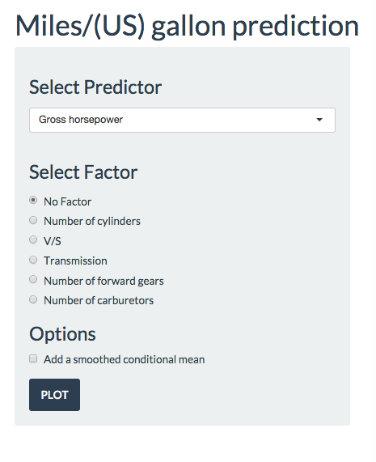

### Submition file include:
- README.html   # introduction and explain for the application
- README.Rmd   # introduction and explain for the application
- ui.R         # ui file for application
- server.R     # server file for application.
- panel.png    # for README file

----------------------------------------------------------
 
### Instructions:
- **ProjectApp** is a shiny application for Coursera Course Project of [Developing Data Products](https://class.coursera.org/devdataprod-011)
- Theis is also my first shiny application
- **ProjectApp** is use for exploring the relationship between a set of variables and miles per gallon (MPG).
- **ProjectApp** is very simple, but I think it's good.
- The application has been host on shinyapps.io, [click here](https://foxet.shinyapps.io/ProjectApp/)
- More Information can be found at http://rpubs.com/foxet/60572

---------------------------------------------------------
### Data:
- The data was extracted from the 1974 Motor Trend US magazine, and comprises fuel consumption and 10 aspects of automobile design and performance for 32 automobiles (1973–74 models)  
```{r echo=FALSE}
data(mtcars)
mtcarsdata<-data.frame(Names=names(mtcars),Description=c("Miles/(US) gallon",
                                           "Number of cylinders",
                                           "Displacement (cu.in.)",
                                           "Gross horsepower",
                                           'Rear axle ratio',
                                           'Weight (lb/1000)',
                                           '1/4 mile time',
                                           'V/S',
                                           'Transmission',
                                           'Number of forward gears',
                                           'Number of carburetors'))
mtcarsdata
```

### Examples:
- Go to my website: https://foxet.shinyapps.io/ProjectApp/
- you will see a panel on the left is for selecting predictors and make set some option. the plot on right side is showing the relationship between the MPG and selected predictor.
- Example: Choose one of the predictor, let's say 'Gross horsepower', and choose 'Add a smoothed condition mean', then click *"PLOT"*. now you can see the plot on the right look just as the plot below:


```{r echo=FALSE,message=FALSE}
library(ggplot2)
qplot(y=mpg,x=hp,data=mtcars,xlab='hp')+geom_smooth()
```

- You can also explore the relationship between MPG and 'Gross horsepower' by different "Number of cylinders. 
- just select variable on 'Factor panel' now you can the plot as follow:  

```{r echo=FALSE}
library(ggplot2)
qplot(y=mpg,x=hp,data=mtcars,xlab='hp',color=factor(cyl))+ guides(color=guide_legend(title='cyl'))
```

