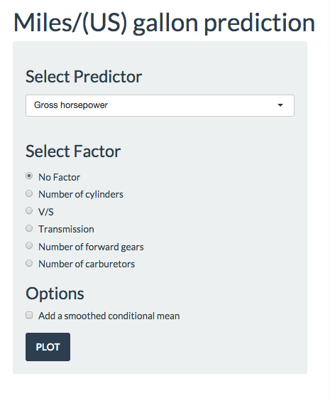
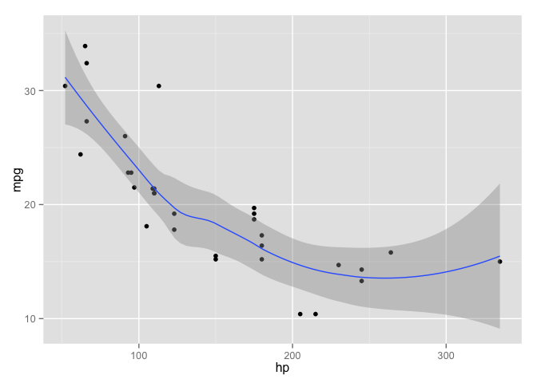

# README
Fan LIN  
2015-2-20  
### Submition file include:
- README.html   # introduction and explain for the application
- README.Rmd   # introduction and explain for the application
- README.pdf   # introduction and explain for the application
- ui.R         # ui file for application
- server.R     # server file for application.
- panel.png    # for README file

Infomation can also be found  

http://foxet.github.io/ProjectApp-For-Developing-Data-Products/README.html
----------------------------------------------------------
 
### Instructions:
- **ProjectApp** is a shiny application for Coursera Course Project of [Developing Data Products](https://class.coursera.org/devdataprod-011)
- Theis is also my first shiny application
- **ProjectApp** is use for exploring the relationship between a set of variables and miles per gallon (MPG).
- **ProjectApp** is very simple, but I think it's good.
- The application has been host on shinyapps.io, [click here](https://foxet.shinyapps.io/ProjectApp/)
- More Information can be found at http://rpubs.com/foxet/60572

---------------------------------------------------------
### Data:
- The data was extracted from the 1974 Motor Trend US magazine, and comprises fuel consumption and 10 aspects of automobile design and performance for 32 automobiles (1973–74 models)  

```
##    Names             Description
## 1    mpg       Miles/(US) gallon
## 2    cyl     Number of cylinders
## 3   disp   Displacement (cu.in.)
## 4     hp        Gross horsepower
## 5   drat         Rear axle ratio
## 6     wt        Weight (lb/1000)
## 7   qsec           1/4 mile time
## 8     vs                     V/S
## 9     am            Transmission
## 10  gear Number of forward gears
## 11  carb   Number of carburetors
```

### Examples:
- Go to my website: https://foxet.shinyapps.io/ProjectApp/
- you will see a panel on the left is for selecting predictors and make set some option. the plot on right side is showing the relationship between the MPG and selected predictor.
- Example: Choose one of the predictor, let's say 'Gross horsepower', and choose 'Add a smoothed condition mean', then click *"PLOT"*. now you can see the plot on the right look just as the plot below:


 

- You can also explore the relationship between MPG and 'Gross horsepower' by different "Number of cylinders. 
- just select variable on 'Factor panel' now you can the plot as follow:  

 

