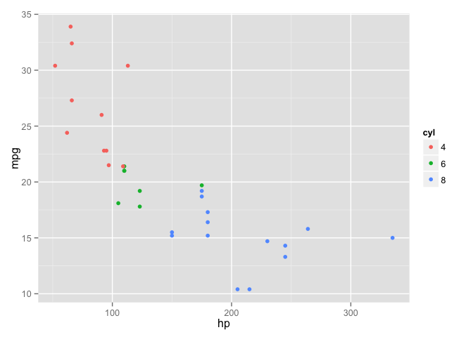

# README
Fan LIN  
2015-2-20  
### Submition file include:
- README.html   # introduction and explain for the application
- README.Rmd   # introduction and explain for the application
- README.pdf   # introduction and explain for the application
- ui.R         # ui file for application
- server.R     # server file for application.
- panel.png    # for README file

- Infomation can also be found: http://foxet.github.io/ProjectApp-For-Developing-Data-Products/README.html

----------------------------------------------------------
 
### Instructions:
- **ProjectApp** is a shiny application for Coursera Course Project of [Developing Data Products](https://class.coursera.org/devdataprod-011)
- Theis is also my first shiny application
- **ProjectApp** is use for exploring the relationship between a set of variables and miles per gallon (MPG).
- **ProjectApp** is very simple, but I think it's good.
- The application has been host on shinyapps.io, [click here](https://foxet.shinyapps.io/ProjectApp/)
- More Information can be found at http://rpubs.com/foxet/60572

---------------------------------------------------------
### Data:
- The data was extracted from the 1974 Motor Trend US magazine, and comprises fuel consumption and 10 aspects of automobile design and performance for 32 automobiles (1973–74 models)  

<!-- html table generated in R 3.1.2 by xtable 1.7-4 package -->
<!-- Fri Feb 20 20:24:55 2015 -->
<table border=1>
<tr> <th>  </th> <th> Names </th> <th> Description </th>  </tr>
  <tr> <td align="right"> 1 </td> <td> mpg </td> <td> Miles/(US) gallon </td> </tr>
  <tr> <td align="right"> 2 </td> <td> cyl </td> <td> Number of cylinders </td> </tr>
  <tr> <td align="right"> 3 </td> <td> disp </td> <td> Displacement (cu.in.) </td> </tr>
  <tr> <td align="right"> 4 </td> <td> hp </td> <td> Gross horsepower </td> </tr>
  <tr> <td align="right"> 5 </td> <td> drat </td> <td> Rear axle ratio </td> </tr>
  <tr> <td align="right"> 6 </td> <td> wt </td> <td> Weight (lb/1000) </td> </tr>
  <tr> <td align="right"> 7 </td> <td> qsec </td> <td> 1/4 mile time </td> </tr>
  <tr> <td align="right"> 8 </td> <td> vs </td> <td> V/S </td> </tr>
  <tr> <td align="right"> 9 </td> <td> am </td> <td> Transmission </td> </tr>
  <tr> <td align="right"> 10 </td> <td> gear </td> <td> Number of forward gears </td> </tr>
  <tr> <td align="right"> 11 </td> <td> carb </td> <td> Number of carburetors </td> </tr>
   </table>

### Examples:
- Go to my website: https://foxet.shinyapps.io/ProjectApp/
- you will see a panel on the left is for selecting predictors and make set some option. the plot on right side is showing the relationship between the MPG and selected predictor.
- Example: Choose one of the predictor, let's say 'Gross horsepower', and choose 'Add a smoothed condition mean', then click *"PLOT"*. now you can see the plot on the right look just as the plot below:

 

- You can also explore the relationship between MPG and 'Gross horsepower' by different "Number of cylinders. 
- just select variable on 'Factor panel' now you can the plot as follow:  

 

